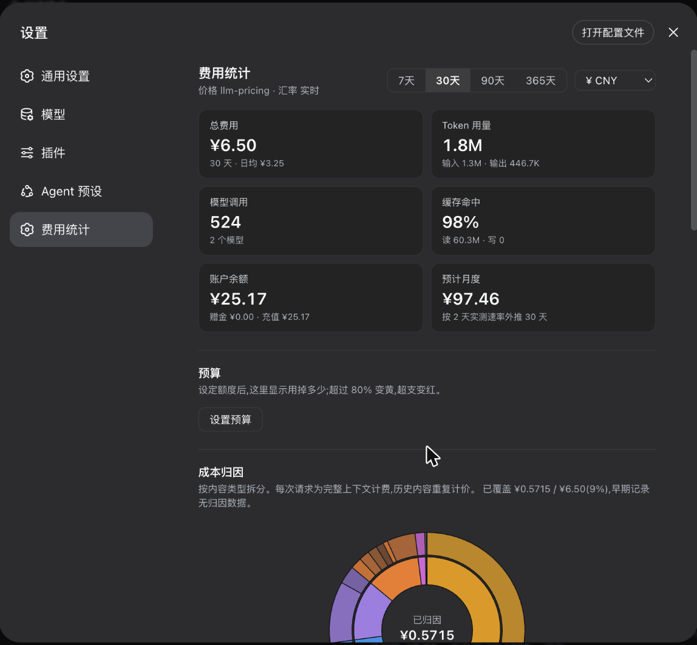

# dsh-bill

DSH(DeepSeek Harness)费用统计插件。输入框下一行看花了多少,设置页里看花在了什么上。



## 功能

- **会话费用行** —— 官方统计条下方一行,「报告」直达完整报告页。

  

- **成本归因** —— 按内容类型拆分账单:工具输出、模型输出、系统提示词、终端命令(按 `git` / `pnpm` / `rg` 分组)、工具输入、附件、系统提醒、用户输入。旭日图支持下钻,点任意类别展开其明细。
- **用量仪表盘** —— 总费用 / Token / 调用数 / 缓存命中 / 高峰占比,按模型费用榜(含各模型基础单价)、每日趋势、周 × 小时热力图,支持 7 / 30 / 90 / 365 天。
- **多币种** —— 实时汇率(约 166 种货币,24h 缓存,离线回退固定平价),任意货币显示;各模型基础单价按其官方定价货币展示(DeepSeek `¥/M`,OpenAI 等 `$/M`)。
- **峰谷占比** —— DeepSeek 等按 UTC 时段计价的模型,统计高峰价消费占比。全天单一价的模型不显示此项。

## 选型对比

DSH 生态里已有几个费用统计插件,各有侧重。下表按代码实测,不按 README 宣称(对比时间 2026-08-16,版本:`dsh-cost` 0.2.1 / `dsh-cost-log` 1.0.0 / `dsh-usage` 0.1.1 / `dsh-usage-billing` 0.2.2):

| | **dsh-bill** | dsh-cost | dsh-cost-log | dsh-usage | dsh-usage-billing |
| --- | --- | --- | --- | --- | --- |
| 价格来源 | 在线目录 8000+ 条目 | 内置 4 个 DeepSeek | 内置 2 个 DeepSeek | 用户自填 | 内置 DeepSeek |
| 非 DeepSeek 模型 | ✓ | ✗ | ✗ | 需逐个手填 | ✗ |
| 峰谷计价 | ✓ | ✗ | ✓ | ✗ | ✓ |
| 历史不被重新计价 | ✓ | ✗ | ✓ | ✓ | 需手动回填 |
| 未收录模型 | 标记 `?`,不计入合计 | 回退按 v4-pro 计 | 标记 `≈` | 标记 `--` | 计 0 |
| **按内容类型归因** | **✓** | ✗ | ✗ | ✗ | ✗ |
| 多币种 + 实时汇率 | ✓ 约 166 种 | 随界面语言 ¥/$ | ¥/$ 可选 | 单一币种,无换算 | 仅 ¥ |
| 统计范围 | 全局 + 会话,7/30/90/365 天 | 当前会话 | 当前会话 | 全局 + 会话 | 全局 + 会话,日/周/月/年 |
| 图表 | 旭日图(可下钻)、时间线、热力图 | 无 | 无 | 52 周热力图 | 热力图、条形图 |
| 账户余额 | ✗ | **✓** | ✗ | ✗ | ✗ |
| 安装前历史回填 | ✗ | ✗ | ✗ | ✗ | **✓** |
| 中英文 | ✗ 仅中文 | ✓ | ✓ | 仅英文 | ✓ |

**dsh-bill 独有的两点:**

- **在线价格目录。** 其余四个都是内置价格表(或让你手填),覆盖 2–4 个 DeepSeek 模型;换个 provider 就没有价格。dsh-bill 通过 [`llm-pricing`](https://github.com/Jannchie/llm-pricing) 拉取 models.dev + OpenRouter,8000+ 条目,并保留历史价格轴。
- **按内容类型归因。** 四个竞品都只回答「花了多少」;没有一个把一次请求的输入 token 拆成工具输出 / 系统提示词 / 历史对话 / 用户输入。最接近的是 `dsh-usage` 的 `agent` / `compaction` 拆分 —— 那是按**调用用途**分,不是按**内容**分。

**它们做得比 dsh-bill 好的地方,如实列出:**

- `dsh-cost` 有**账户余额**显示(DeepSeek `/user/balance`,密钥不出后端),dsh-bill 没有;
- `dsh-usage-billing` 能**回填安装前的历史**(扫描会话日志重建全量账单),还提供 `usage_stats` **agent 工具**(可以直接问模型「我花了多少」)和 HTTP API;dsh-bill 只统计安装之后的调用;
- `dsh-usage` 在每条助手消息下方给出**该轮的费用**,并用纳单位整数运算避免亚分位被抹零;
- `dsh-cost-log`、`dsh-usage-billing`、`dsh-cost` 都有**中英文**,dsh-bill 目前只有中文。

如果你只用 DeepSeek 官方 API、只想在输入框旁看个数,上面几个更轻。dsh-bill 的取舍是:多模型、可追溯的价格轴,以及回答「钱花在什么内容上」。

## 安装

```bash
dsh plugin --profile web add dsh-bill
```

重启 `dsh web` 生效。

## 配置

`~/.dsh/profiles/web/cordis.patch.yml`,给 `bill` 行加 `config`:

```yaml
- insert:
    - id: bill
      name: 'dsh-bill'
      config:
        priceOverrides:
          'anthropic/claude-sonnet-4-6':
            inputPerM: 3.0        # 每百万 token 输入(未命中),USD
            outputPerM: 15.0
            cacheReadPerM: 0.3
            cacheWritePerM: 3.75
            displayName: 'Claude Sonnet 4.6'
```

## 计价

计价由 [`llm-pricing`](https://github.com/Jannchie/llm-pricing) 提供:

- models.dev + OpenRouter 双目录(24h 缓存并落盘,8000+ 条目),失败回退内置历史快照;
- DeepSeek 官方直连价覆盖目录报价,按调用时刻自动选择峰谷价;
- 价格按时间轴存储,厂商调价不会重算历史记录;
- 模型名归一化,匹配不到的模型标记为「?」,不参与合计 —— 不估算。

## 归因方法

每次请求都要为完整上下文重新付费,因此一次读入的工具输出会在后续每次请求中继续计费,直到滑出上下文。归因逐请求计算后累加。

两个关键点:

- **按位置定价。** 前缀缓存下,prompt 的前 N 个 token 走缓存价,其余走全价 —— DeepSeek 上两者相差最多 156×。内容片段严格按 provider 接收顺序排列,缓存前缀按缓存价计,仅尾部付全价。按平均单价分摊会把费用记到错误的类别上。
- **只保留计数。** 归因在捕获时对实时请求完成,落盘仅保存各类别金额,不保存任何 prompt 文本。

各片段的 token 数按字符占比估算(provider 只返回总数),但总额取真实计费值,因此各项精确加总到实付金额。启用归因前的记录无内容可追溯,报告中会标注已覆盖比例。

## 数据与隐私

- 记录每次调用的 provider / model / token 用量(未命中输入 / 缓存读 / 缓存写 / 输出)及归因金额;
- 落盘至 `$DSH_HOME/dsh-bill/records.jsonl`(默认 `~/.dsh/`,2 万条环形缓冲),重启恢复;
- 全部本地处理,除价格目录与汇率接口外不上传任何数据。

## 实现

| 层 | 实现 |
| --- | --- |
| 捕获 | 监听 `llm/stream` waterfall,包装流观察 `usage` chunk,原样透传 |
| 计价 | 按调用时刻交由 `llm-pricing` 解析目录 / 峰谷 / 覆盖价 |
| 归因 | 捕获时切分请求为分类片段,按缓存前缀位置分摊 |
| 存储 | 内存环形缓冲 + JSONL 持久化 |
| API | `POST /dsh-bill/api`(overview / session-cost / dashboard / fx) |
| UI | `conversation.composer.dock` 费用行 + `settings.section` 报告页 |

## License

MIT
